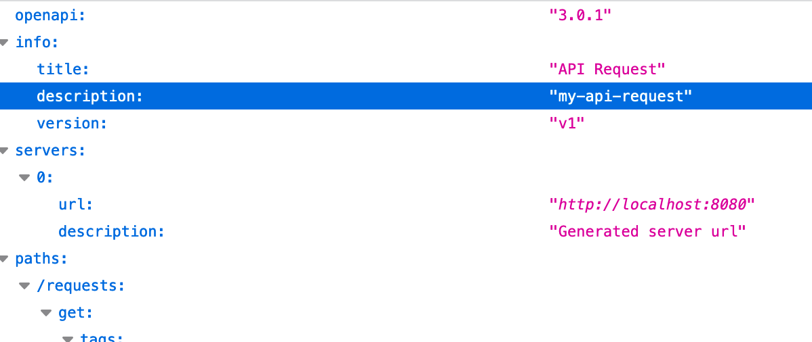
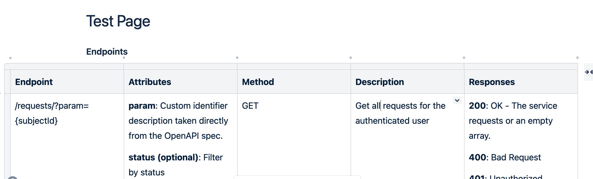

===============================
Confluence-OpenAPI-Table-Update
===============================
-----------------------------------
Let code generate confluence tables
-----------------------------------

Introduction
============

This script is used to update tables in confluence based on OpenAPI spec. 

The goal is to take OpenAPI spec like this:
[image](example-spec.png)
and make it look like a table in confluence like this:
[image](example-table.png)

Description
-----------

Python script to update tables in confluence based on OpenAPI spec

Long Description
----------------

Python command line to take OpenAPI/Swagger JSON definition and update tables within confluence

Usage
-----

python confluence-openapi-table-update.py --open-api-json-url https://petstore.swagger.io/v2/swagger.json --confluence-url https://myconfluence.atlassian.net

Options
-------

-h, --help          show help message and exit
--open-api-json-url OPEN_API_JSON_URL
                    OpenAPI json url
--confluence-url CONFLUENCE_URL
                    Confluence url
--confluence-email CONFLUENCE_EMAIL
                    Confluence email
--confluence-token CONFLUENCE_TOKEN
                    Confluence personal API token
--confluence-space CONFLUENCE_SPACE
                    Confluence space
--confluence-page-title CONFLUENCE_PAGE_TITLE
                    Confluence page title
--confluence-page-insertion-tag CONFLUENCE_PAGE_INSERTION_TAG
                    Confluence page insertion tag (table will replace
                    table after this tag)

Example
-------

Example of OpenAPI spec

Image of example table

